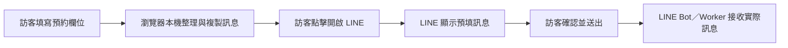

# Campcool AI 維護指南

這份文件提供 AI 開發代理與後續維護者目前有效的產品事實、改版決策及防回歸規則。一般專案說明與本機預覽方式請見 [`README.md`](README.md)；公開的服務、價格與地區資料分別以 [`services.md`](services.md)、[`pricing.md`](pricing.md)、[`areas.md`](areas.md) 及 [`faq.md`](faq.md) 為準。

最後更新：2026-08-16

## 專案與執行來源

- 正式網站是 GitHub Pages 上的靜態網站，網域為 `campcool.tw`。
- `index.html` 是正式首頁，包含主要 HTML、CSS 與原生 JavaScript，沒有建置步驟或執行期框架。
- `*.jsx` 是早期元件參考，不會載入正式網站。修改正式介面時，必須先改實際使用中的 HTML。
- `scripts/validate-site.mjs` 是網站內容、內嵌腳本、JSON-LD、canonical、sitemap 與重要產品規則的防回歸檢查。

## 2026-07-30 改版基準

### 預約資料與 LINE 流程

官網預約表單只在訪客的瀏覽器內整理並複製訊息，不會在開啟 LINE 前把姓名、手機、日期或租借需求傳送到 Campcool Worker／D1。



維護規則：

- 不得重新加入預約表單對 `/public/booking-leads` 的預先 POST。
- 不得在 LINE 送出前把 `renter_contact`、`ga_client_id` 或其他聯絡資料寫入 Worker／D1。
- `booking_form_view` 與 `booking_message_composed` 只用於一般漏斗分析，不算 LINE 聯絡轉換。
- 只有實際開啟 LINE 的動作才記錄 GA4 `line_click`，並在設定 `ADS_CONVERSION_LABEL` 時送出 Google Ads conversion。
- LINE 預填訊息保留 `[來源:booking_form]` 標記，供 LINE Bot 在收到實際訊息後識別來源。
- 頁面必須明確告知訪客：內容只在此裝置整理，Campcool 尚未收到資料，需在 LINE 內確認並自行送出。

### LINE CTA 動效

- 主要 LINE CTA 使用 `cc-line-shimmer`，每 3 秒短暫流光一次。
- 流光只使用 transform 與 opacity，不攔截點擊。
- 必須保留 `@media (prefers-reduced-motion: reduce)`，讓偏好減少動態效果的訪客停用動畫。
- 預約結果中的「開啟 LINE 確認並送出」放在長訊息預覽之前，確保手機版立即看得到下一步。

### 取件政策

所有取件點都採預約制。不得宣稱 `24H 取還`、`24H 自取`、`社區寄櫃`、提供取件碼或可隨時自取。

目前有效說法：

- 竹北仍可使用「竹北社區取件」，但必須先透過 LINE 約定時間與交付方式。
- 公道五路、內湖、士林、五股與台中西屯同樣採預約取還。
- 未預約請勿直接前往。
- 目前不提供宅配、郵寄或直接送到營區。

涉及取件政策的主要檔案：

- `index.html`
- `hsinchu.html`
- `taipei.html`
- `taichung.html`
- `emergency-ac.html`
- `faq.html`
- `how-it-works.html`
- `reviews.html`
- `areas/*.html`
- `areas.md`、`faq.md`、`services.md`

### 社群分享定位

首頁的 OG 與 Twitter 預覽採「露營冷氣知識／選購指南」定位，讓 Campcool 能以知識型內容在 Facebook、Instagram 與社群分享。這是既定行銷策略，不應改成直接促銷型標題或廣告式封面，除非產品負責人明確要求。

保留重點：

- 知識型 OG title、description 與 `assets/og-cover.jpg`
- BTU、用電與機型比較的內容入口
- 分享預覽與站內租借轉換可以有不同角色

## 2026-08-16 改版基準

### 機型適用尺寸（唯一權威，不得再出現第二套）

**分界：3×3（300×300cm ＝ 9 ㎡ ≈ 2.72 坪）**

- 3×3 及以下 → 艾比酷 JUZ-400（5100 BTU）
- 超過 3×3 → 山水 SAC688（6300 BTU）
- 睡 5 人以上一律 SAC688

改版前站上有四套互斥規則，同一頂 300×300 帳在兩支計算機會得到相反答案。
維護規則：

- 兩支計算機門檻**必須一起改**，否則矛盾會重現：
  - `calcRecommend()`：單位為坪，`area > 2.75`
  - `onTentModelChange()`：單位為平方公尺，`area > 9`
- 不得再使用「4×4 以上」的說法（會讓 3×3～4×4 之間變成空窗），
  也不得使用「3-5 坪 / 5-8 坪」的舊標示。
- 文案分散於 index.html（規格卡、Product JSON-LD、MODEL_SPEC、SEO 入口）、
  faq.html、faq.md、btu-guide.html、juz-400.html、sac-688.html、
  camping-ac-rental.html、areas/taipei.html、services.md、pricing.md、llms.txt。

### 用電數字

- 露營常見電器加總為 **4.8A**（冷氣 3.9 + 冰箱 0.4 + 燈 0.2 + 手機 0.3）。
  加租製冰機（約 100W ≈ 0.9A）後約 **5.7A**。
- 改版前有 5 處寫 5.3A，與站上自列分項相加不符，讀者可當場推翻，已全部修正。
- **注意區辨**：SAC688 自身耗電 530W ÷ 110V 也是 4.8A，出現在
  index.html 規格卡、MODEL_SPEC、btu-guide 比較表，與上述加總無關，不可混改。

### 價格與押金揭露

- 冷氣押金 **$3,000／台**，必須顯示在首頁價目表，不能只寫在 faq。
- 其它小物**僅「電吉拉 mini 行動電站」收押金 $1,000**，其餘不收；
  頁面須明講「其餘品項不收押金」，否則客戶會以為每項都要壓錢。
- 小物**可單獨租借**，不必一併租冷氣。
- 動力延長線已可加購（5M $100／10M $150），不得再寫「需自備」。

### 轉換追蹤（影響 Google Ads 成效）

- **每個有 LINE 出口的頁面都必須載入 gtag.js 與 logLineClick helper**。
  改版前只有首頁與 emergency-ac 有，其餘 16 頁對 Ads 回報零轉換。
- 新增任何 `lin.ee` 連結時，必須加
  `onclick="logLineClick('<頁面>_<位置>', true)"`。
- 不得使用 `if(window.gtag)gtag(...)` 這種寫法——該頁若未載入 gtag 就是死碼。
- 只有真正開啟 LINE 的動作才傳 `convert=true`；站內導覽只記 GA4 事件。

### 圖片

- 頁內 `` 一律使用 webp（`logo-88` / `sac688_product` / `og-cover` /
  `addon-*`）。
- **`og:image`、`twitter:image` 與所有 JSON-LD 的 `logo`／`image` 欄位一律維持
  `.jpg`**，社群平台與搜尋引擎對 webp 支援不一；原始 jpg 檔案不得刪除。
- 圖片必須帶 `width`／`height`，且數值要與實際檔案相符（改版前有兩張不符造成
  版面位移）。

### 結構化資料

- **首頁不得再加入 FAQPage**：頁面上沒有對應可見內容，違反 Google 政策。
  FAQ 結構化資料集中在 faq.html。
- 兩台冷氣的 Product 以 `@id` 與機型頁合併，`offers.url` 指向各自機型頁。
- reviews.html 的 Organization 以 `@id` 指向首頁 LocalBusiness。
- LocalBusiness 的 `address` 為 **竹北市／新竹／TW**，與 geo 座標一致。
- 評分 4.95／160 則來源為 **LINE 官方帳號累積回饋，非 Google 商家評論**，
  reviews.html 必須保留來源揭露文字。
- `areas/taipei.html`、`areas/hsinchu.html`、`areas/taichung.html` 是
  meta-refresh 轉址殘頁，**任何連結與 JSON-LD 都不得指向它們**；
  `areas/new-taipei.html` 才是新北的正規頁。

### 其它小物分頁

- 分頁 `data-tab` 維持 `fridge`（保住既有 `#fridge` 深連結與 localStorage），
  顯示名稱為「其它小物」。
- 15 個品項分 6 個 `<details>` 分類抽屜，卡片為 `<label>` + 隱藏 checkbox。
- 勾選流程：`addonsUpdate()` 更新小計 → `addonsToForm()` 寫入
  `#bkNote` 並跳至預約表單，客戶於 LINE 送出。
- **新增或改價品項時，index.html 與 `pricing.md` 必須同步。**

### 無障礙與行動裝置（防回歸）

- 公告輪播**不得**加回 `aria-live`（每 4 秒打斷螢幕閱讀器），
  且必須保留「暫停輪播」按鈕。
- 選購指南子頁籤 sticky 為 `top:69px`（低於 header 65px 會被蓋住）；
  `html` 需保留 `scroll-padding-top:72px`。
- `body` 底部留白須含 `env(safe-area-inset-bottom)`。
- `prefers-reduced-motion` 的 media block **必須放在樣式表最後**，
  否則會被後面的動畫宣告覆蓋（已實測）。
- 資訊性灰字使用 `#6b7280`，不得改回對比不足的 `#9ca3af`。
- 取機日期須設 `min` 並在 `submitBooking()` 內再次把關（min 不約束 JS 送出）。

## 2026-08-16 Manus 滿分制第二輪優化

此輪由 Manus 以 100 分滿分制（五維度加權：功能完成度/穩定與安全 25%、可維護與交接 20%、使用者體驗 15%、成本效益 15%）接手 Claude 完成的 20 commits，執行十角色辯證後的修改。辯證裁決（不可逆）：不抽離 inline CSS/JS（保住零建置）、不做 PWA manifest（非 Web App）、保留 areas 殘頁+補 noindex（歷史連結不中斷）、不動 Claude 已定的產品事實（機型分界/押金/取件政策/LINE 流程）。

### 已完成的修改

| 項目 | 說明 |
|---|---|
| 死重圖片刪除 | `git rm assets/homepage_hero.png`（1.5MB）與 `taiwan_map.png`（912KB）；防回歸斷言已加（引用+git index 雙檢查） |
| 評論圖 webp 化 | reviews.html + index.html 的 review-01~05 webp 化，節省約 1.1MB；og/JSON-LD 層 jpg 依既有政策保留 |
| areas 殘頁 | taipei/hsinchu/taichung 補 `noindex`（meta-refresh 轉址頁不參與索引，validate 逐頁檢查） |
| GA4 fetch | index.html 的 config fetch 加 3 秒 AbortController 逾時（IIFE 閉包）；**注意：正式 GA4 ID 尚未掛上**，Worker 目前回傳 `{"ga4_measurement_id":""}`，架構正確、優雅降級，等老闆提供 ID |
| llms.txt | 更新至 2026-08-16：加 15 品項小物清單（價格以頁面 data-price 實測為準）與機型分界規則；validate 檢查新鮮度 ≤ 60 天且價格表覆蓋 ≥ 15 品項 |
| 防回歸驗證 | `scripts/validate-site.mjs` 從 6 項擴充至 20 項斷言（見下）並加 `--selftest` 防假綠模式 |
| CI 門禁 | `.github/workflows/site-check.yml`：push/PR 觸發，先跑 selftest 再跑完整 validate，外加 Worker config endpoint 探針 |

### validate-site.mjs 新增斷言（配合既有 6 項）

死重圖引用消失、每頁 LINE CTA 閉環（areas 殘頁除外）、兩支計算機門檻一致（`area > 2.75` 坪 / `area > 9` ㎡ / `area > 16` 坪拒租）、16 品項逐項存在（非僅計數——單品項改名計數不變，實測抓到漏洞）、config endpoint 版號統一且 14 頁覆蓋、areas 殘頁 noindex、評論 img src 僅限 1 張 jpg（產品實照）、llms.txt 新鮮度、git index 不含死重圖。

防假綠用法：`node scripts/validate-site.mjs --selftest` 會故意破壞 4 類產品事實（必留文案/禁入標記/計算機門檻/小物品項），確認 validate 全部抓住後還原，任何一步不符預期 selftest 本身 exit 1。CI 先跑 selftest 再跑完整 validate，杜絕「驗證腳本本身失效」的假綠。

## 待老闆確認事項（2026-08-16）

以下項目頁面上已標示「待確認」，不影響出租，取得後補上即可：

| 項目 | 需要什麼 | 影響 |
|---|---|---|
| 投影機耗電瓦數 | 瓦數 | 營區用電建議目前只算到製冰機 |
| 製冰機型號、製冰量 | 型號與製冰量（瓦數已有 100W） | 照片為白色桌上型通用款，型號待老闆對照 |
| ADAM OUTDOOR 渦輪扇型號 | 確切型號（該品牌多款差異大） | 照片為 ADAM OUTDOOR 沙色款，型號待老闆對照 |
| 動力延長線規格 | 5M／10M 與實機對照 | 照片為 ADAM OUTDOOR 軍綠款，實品長度待老闆確認 |
| 簡易焚火台尺寸 | 展開／收納尺寸 | 卡片標示 |
| 電吉拉 mini 實機重量 | 重量 | 客戶在意能不能扛上營位 |
| 5×8 天幕、黑狗穹頂 | 重量與收納尺寸 | 卡片標示 |
| 冰虎 ALPICOOL C40 | 對照實機確認 40L／14kg／60W | 取自公開資料未核對 |

**商品照**：16 項已全部上線（320×320 webp）。2026-08-16 由 Manus 補齊剩餘 6 張：
動力延長線 5M／10M（依老闆指定換 ADAM OUTDOOR 軍綠款）、製冰機（白色桌上型小款，型號未定）、渦輪扇（ADAM OUTDOOR 沙色款）。
燈條已於同日第三次替換：五米／十米改用同一張用戶提供實拍圖（`assets/addon-lamp-5m.webp` 共用，裁除「10米燈條大全配」紅字）；
另新增第 16 品項「G40 復古 LED 燈串」$200（`assets/addon-lamp-g40.webp`，裁除「G40 LED燈串」橘字廣告，卡片插於照明 drawer 內）。
檔名慣例 `assets/addon-*.webp`，裁切時已移除賣場行銷字樣。
製冰機圖取自網路商品圖，正式營業前建議以自家庫存品照片替換（規格同：320×320 webp、直插 ``）。
移動冰箱已於上一輪用實拍圖上線（本輪又依老闆提供 CX40 規格圖替換：586×378×475mm，320×320 webp）。
燈條圖與 G40 圖為老闆提供的實品照片，非網路抓圖，可信度最高。

**UI/UX 優化（2026-08-16）**：老闆實測反饋圖仍只佔一點點，改為左右兩欄平行佈局——左圖（ad-photo 120×120 與卡等高、align-self:center 中置）、右邊品名／價格／規格：新增 `.ad-head`（flex，品名與 `.ad-price` 左右分佈）與 `.ad-title`，全部 16 張卡片 HTML 由 `_restructure_cards.py` 重排完成。ad-pill 加 `white-space:nowrap` 防止長標籤換行溢出（電吉拉 mini「45 分回充 80%」文案同步縮短）。冰箱注意事項已刪，改為整體租借保障（抵達營區時立即反映＋使用不當酌收費用）。

**手機排版根因修復（2026-08-16，commit ed3114b）**：左右佈局上線後老闆實機截圖顯示品名逐字斷行、價格被切、標籤撐出卡右緣。本地 390px 重現不出的原因是根因有三層，皆已在 CSS 一次到位：
1. **flex 子項不允許縮小於內容**（`min-width:auto`）：`.ad-name`／`.ad-brand` 缺 `min-width:0` 保護，長品名（如「C40 移動冰箱 40L」）把 `.ad-card` 撐寬超過 grid 格寬，內容溢出卡外、價格被螢幕邊緣切掉。修法：`.ad-head` 與 `.ad-title` 補 `min-width:0`。
2. **逐字斷行**：`.ad-name` 缺換行控制。修法：`word-break:keep-all; overflow-wrap:break-word`，中文字只在詞界換行。
3. **容器無收邊**：`.ad-card` 與 `.ad-drawer` 補 `overflow:hidden`；`.ad-price` 改 `flex:0 0 auto` 強制不縮。手機 520px 以下同步降級：圖 100px、品名 1rem、價格 1.2rem、pill 0.66rem。commit 後以 390px 與 360px 雙 viewport playwright 截圖逐卡驗證通過（`scripts/_shot_addons.py`、`scripts/_shot_360.py`），validate 20 項與 selftest 4 破壞全綠。接手注意：此組 CSS 規則（1361-1385 行、1432 行）是 16 張卡片的骨架，改動品名/價格字級前務必同步檢視手機降級 block 並重跑雙 viewport 驗證。

**防字級放大溢出（2026-08-16，commit b07f419）**：老闆再報「價格還是被切」，本輪抓出上一輪沒看到的真根因：老闆手機開了**系統字級放大（約 1.15-1.25 倍）**，本地標準渲染重現不出；且上一輪 overflow 檢查程式有盲點——它只量卡片外框右界（卡本身沒超寬），內容溢出被 `overflow:hidden` 切掉反而顯示 0 issues。本輪解法四重保險：① `.ad-head` 改 `flex-direction:column`（品牌→品名→價格直排，三者都是全寬行，不再互相搶右欄空間）；② `.ad-price` 去 `nowrap` 改 `word-break:keep-all; overflow-wrap:break-word`（價格極窄時可在／前斷行）；③ 新增 **container query**（`.ad-drawer { container-type:inline-size }`，`@container (max-width:300px)`）：字級放大把佈局視口壓縮時，卡片自動改成上圖下文垂直排、圖 100% 寬、文字全寬——媒體查詢偵測不到 zoom，容器查詢量的是卡自身 CSS px，偵測得到；④ 手機 520px 以下圖 96px、價格 1.15rem。已用 `scripts/_final_check.py` 跑 8 情境（412/390/360 標準 × 1.15/1.25/1.3/1.4/1.5 zoom）共 128 卡次檢查，0 issues。validate 20 項與 selftest 4 破壞全綠。接手注意：zoom 類問題的驗證務必在 playwright 用 `documentElement.style.zoom` 模擬字級放大，不能只看標準 viewport。

**租借保障文案（2026-08-16）**：刪除原冰箱注意事項四張卡，改為整體租借保障兩條：①商品有問題請於抵達營區時立即反應；②不清楚使用方式請與店家詢問或上網搜尋，使用不當導致故障將酌收費用。

**已決策定案**（不需再問）：機型分界 3×3、評價來源為 LINE、
商家地址竹北市、小物可單獨租借且僅電吉拉收押金 $1,000、
雨天維持最保守說法、營區筆數維持 600+ 暫不核對、
電吉拉容量以 **1024Wh** 為準（宣傳圖機身標籤另標 AC180P 1440Wh，
老闆確認採 1024Wh）。

## 修改時的事實優先順序

遇到文件或程式內容不一致時，依下列順序判斷：

1. 使用者最新確認的產品政策
2. 正式執行中的 `index.html` 與獨立 HTML 頁面
3. `scripts/validate-site.mjs` 的防回歸規則
4. `services.md`、`pricing.md`、`areas.md`、`faq.md` 與 `llms.txt`
5. 僅供設計參考、不在正式網站載入的 `*.jsx`

不得自行創造價格、取件方式、服務地區、回覆時間、客戶數、宅配能力或 24 小時服務。

## 驗證

修改網站或產品文案後執行：

```bash
node scripts/validate-site.mjs
git diff --check
```

重要介面變更還要檢查：

- 390px 左右的手機寬度沒有水平溢出
- 代表性桌面寬度的標題、卡片與 CTA 排版正常
- 瀏覽器 console 沒有 JavaScript error
- LINE CTA 觸控高度至少 44px
- reduced-motion 模式不播放流光
- 全站沒有重新出現 24H、寄櫃、取件碼或預先上傳個資的文案與程式

## 本次改版提交

- `5e3424f`：預約內容改為本機整理，修正 LINE 轉換時機並加入 3 秒流光。
- `945d9a1`：移除 24H 社區寄櫃承諾，保留竹北社區預約取件。
- 2026-08-16 共 20 個提交：跨頁事實一致性、押金與租金範圍揭露、
  13 頁補齊轉換追蹤、無障礙與行動裝置修正、結構化資料去重、
  圖片 webp 化、機型尺寸分界統一、冰箱分頁改版為「其它小物」
  （15 品項、分類抽屜、勾選帶入表單）。
