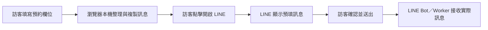

# Campcool AI 維護指南

這份文件提供 AI 開發代理與後續維護者目前有效的產品事實、改版決策及防回歸規則。一般專案說明與本機預覽方式請見 [`README.md`](README.md)；公開的服務、價格與地區資料分別以 [`services.md`](services.md)、[`pricing.md`](pricing.md)、[`areas.md`](areas.md) 及 [`faq.md`](faq.md) 為準。

最後更新：2026-07-30

## 專案與執行來源

- 正式網站是 GitHub Pages 上的靜態網站，網域為 `campcool.tw`。
- `index.html` 是正式首頁，包含主要 HTML、CSS 與原生 JavaScript，沒有建置步驟或執行期框架。
- `*.jsx` 是早期元件參考，不會載入正式網站。修改正式介面時，必須先改實際使用中的 HTML。
- `scripts/validate-site.mjs` 是網站內容、內嵌腳本、JSON-LD、canonical、sitemap 與重要產品規則的防回歸檢查。

## 2026-07-30 改版基準

### 預約資料與 LINE 流程

官網預約表單只在訪客的瀏覽器內整理並複製訊息，不會在開啟 LINE 前把姓名、手機、日期或租借需求傳送到 Campcool Worker／D1。



維護規則：

- 不得重新加入預約表單對 `/public/booking-leads` 的預先 POST。
- 不得在 LINE 送出前把 `renter_contact`、`ga_client_id` 或其他聯絡資料寫入 Worker／D1。
- `booking_form_view` 與 `booking_message_composed` 只用於一般漏斗分析，不算 LINE 聯絡轉換。
- 只有實際開啟 LINE 的動作才記錄 GA4 `line_click`，並在設定 `ADS_CONVERSION_LABEL` 時送出 Google Ads conversion。
- LINE 預填訊息保留 `[來源:booking_form]` 標記，供 LINE Bot 在收到實際訊息後識別來源。
- 頁面必須明確告知訪客：內容只在此裝置整理，Campcool 尚未收到資料，需在 LINE 內確認並自行送出。

### LINE CTA 動效

- 主要 LINE CTA 使用 `cc-line-shimmer`，每 3 秒短暫流光一次。
- 流光只使用 transform 與 opacity，不攔截點擊。
- 必須保留 `@media (prefers-reduced-motion: reduce)`，讓偏好減少動態效果的訪客停用動畫。
- 預約結果中的「開啟 LINE 確認並送出」放在長訊息預覽之前，確保手機版立即看得到下一步。

### 取件政策

所有取件點都採預約制。不得宣稱 `24H 取還`、`24H 自取`、`社區寄櫃`、提供取件碼或可隨時自取。

目前有效說法：

- 竹北仍可使用「竹北社區取件」，但必須先透過 LINE 約定時間與交付方式。
- 公道五路、內湖、士林、五股與台中西屯同樣採預約取還。
- 未預約請勿直接前往。
- 目前不提供宅配、郵寄或直接送到營區。

涉及取件政策的主要檔案：

- `index.html`
- `hsinchu.html`
- `taipei.html`
- `taichung.html`
- `emergency-ac.html`
- `faq.html`
- `how-it-works.html`
- `reviews.html`
- `areas/*.html`
- `areas.md`、`faq.md`、`services.md`

### 社群分享定位

首頁的 OG 與 Twitter 預覽採「露營冷氣知識／選購指南」定位，讓 Campcool 能以知識型內容在 Facebook、Instagram 與社群分享。這是既定行銷策略，不應改成直接促銷型標題或廣告式封面，除非產品負責人明確要求。

保留重點：

- 知識型 OG title、description 與 `assets/og-cover.jpg`
- BTU、用電與機型比較的內容入口
- 分享預覽與站內租借轉換可以有不同角色

## 修改時的事實優先順序

遇到文件或程式內容不一致時，依下列順序判斷：

1. 使用者最新確認的產品政策
2. 正式執行中的 `index.html` 與獨立 HTML 頁面
3. `scripts/validate-site.mjs` 的防回歸規則
4. `services.md`、`pricing.md`、`areas.md`、`faq.md` 與 `llms.txt`
5. 僅供設計參考、不在正式網站載入的 `*.jsx`

不得自行創造價格、取件方式、服務地區、回覆時間、客戶數、宅配能力或 24 小時服務。

## 驗證

修改網站或產品文案後執行：

```bash
node scripts/validate-site.mjs
git diff --check
```

重要介面變更還要檢查：

- 390px 左右的手機寬度沒有水平溢出
- 代表性桌面寬度的標題、卡片與 CTA 排版正常
- 瀏覽器 console 沒有 JavaScript error
- LINE CTA 觸控高度至少 44px
- reduced-motion 模式不播放流光
- 全站沒有重新出現 24H、寄櫃、取件碼或預先上傳個資的文案與程式

## 本次改版提交

- `5e3424f`：預約內容改為本機整理，修正 LINE 轉換時機並加入 3 秒流光。
- `945d9a1`：移除 24H 社區寄櫃承諾，保留竹北社區預約取件。
